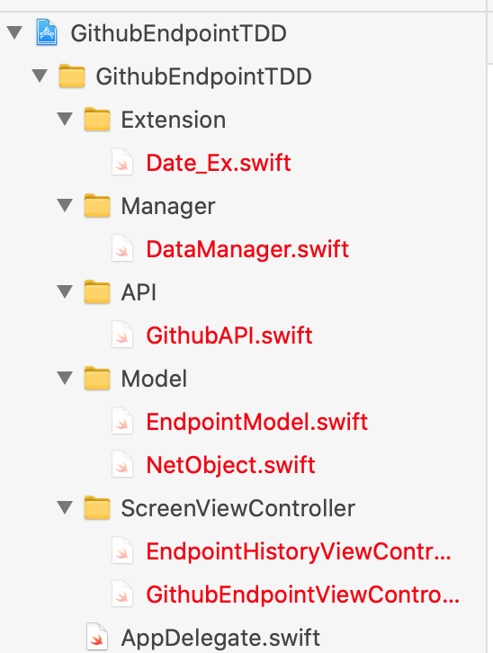
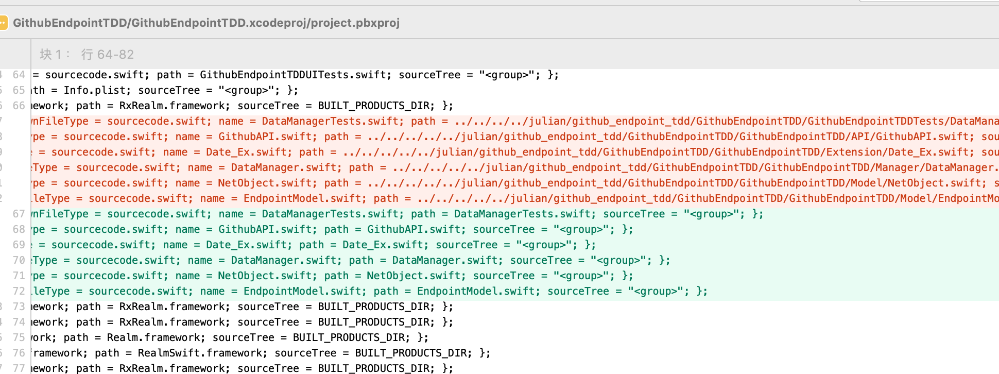
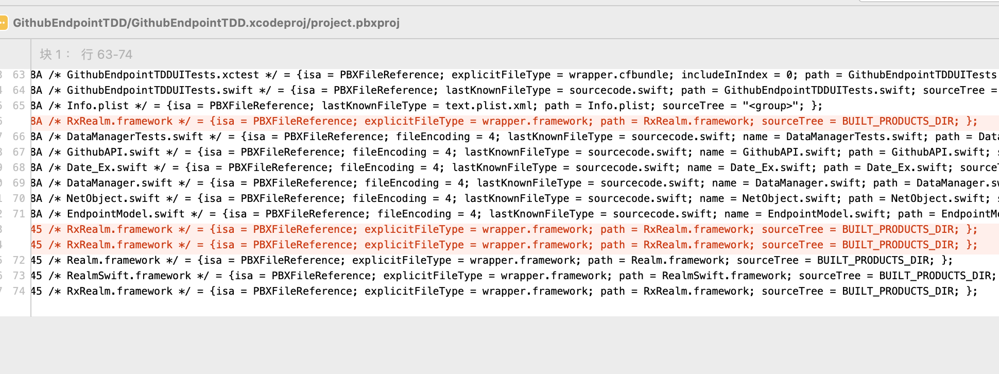
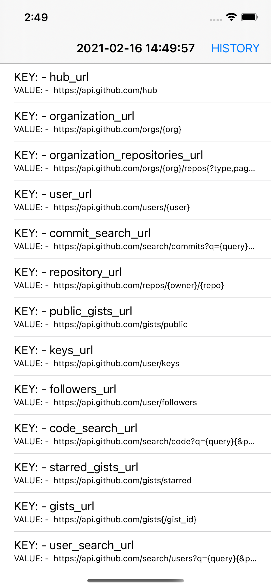
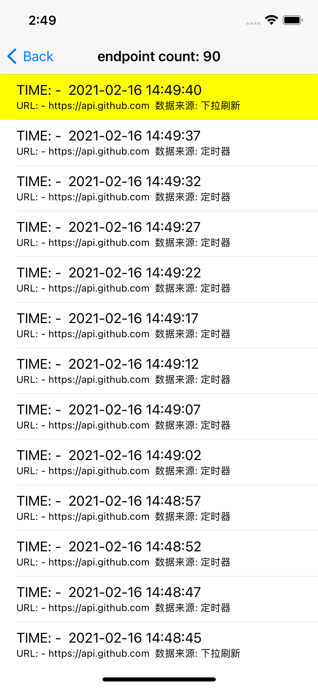

## 介绍
尝试使用TDD模式开发

### 项目工作大纲

#### 1. 准备工作
a. 创建git仓库，使用git flow模式，创建master、develop、feature、hotfix等分支管理项目的开发流程各个阶段；
b. 添加pod管理项目第三方库。

#### 2. 项目需求
A. 通过获取github api endpoint（https://api.github.com） 获取github接口数据，需要缓存每次接口请求的数据节点。
（a）提供缓存节点类【NetObject】包含response、request和timeStamp。

B. 开发两个页面：
（a）接口数据展示页【GithubEndpointViewController】
（b）接口请求历史页【EndpointHistoryViewController】

C. 触发数据请求的机制：
（a）进入项目后开启定时器，5s获取一次endpoint数据，作为一个时间线（类似新闻app，定时请求最新数据，刷新实时新闻）
（b）接口请求历史页的下拉刷新（类似新闻app，用户手动触发刷新实时新闻）

#### 3. 需求分析
A. 需求中数据流分析
（a）进入项目 -> 获取缓存数据（b）-> 缓存起来 -> 展示最新的1条在【数据展示页】
（b）获取缓存数据 -> 缓存起来 -> 生成缓存列表 -> 展示在【请求历史页】
以上可见：有共同的逻辑，请求数据 -> 缓存 -> 生成缓存列表
所以，没有采用MVVM模式，而是采用数据管理类【DataManager】处理数据请求、缓存、生成列表等，选用存储方式Realm。

B. 需求中用户事件
（a）历史页中用户可以下拉刷新最新数据（需求中没表明是否需要打断定时器，暂不考虑），采用第三方库MJRefresh库。

#### 4. 编写测试案例
见单元测试类
#### 5. 开发出现的异常
A. 文件引用路径问题

**属于git问题，开发了两次问题依旧一样，后面查找项目配置文件才发现是采用了绝对路径。前期走了不少弯路，以为是.gitignore文件问题**
--
B. 第三方库链接（link）问题

**属于pod或者realm问题吧，暂不情况。开发了两次问题依旧一样，后面查找项目配置文件才发现多处描述了RxRealm链接路径导致异常。前期走了不少弯路，以为是证书问题和pod install问题，但也时而有效（删除xcodeworkspace文件和pods文件，重新pod install）**
--
#### 6. 完成效果

#### 7. 总结
感谢这次机会，不管结果如何还是收获很多。重新重温了RxSwift、单元测试、UI测试以及Git flow等。特别是上面遇到的两个异常，前期尝试了很多方法，最后发现还是得需要静下来从项目配置文件中入手，最终解决...